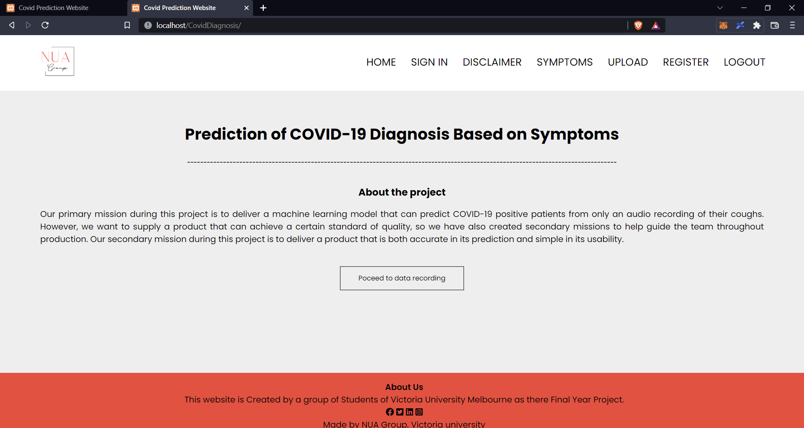
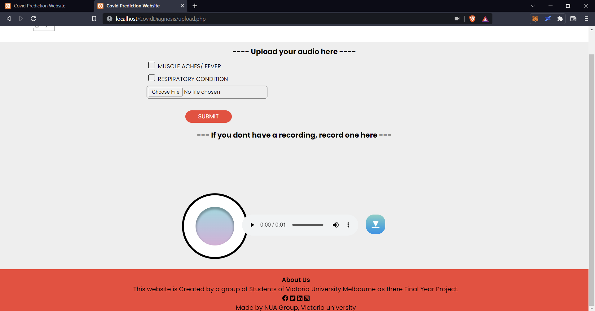
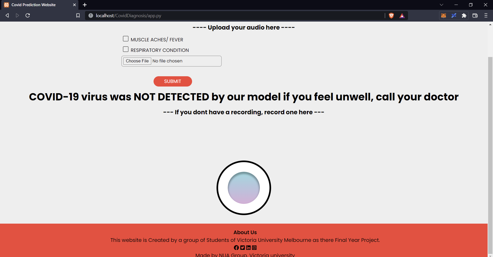

# Covid Cough Diagnosis
## _A Machine Learning Web Application for Covid-19 Diagnosis_


This repository is a out-of-the-box, rapid solution to Covid-19 diagnosis.
Powered by a robust machine learning algorithm and a responsive front end, you can receive an accurate Covid-19 diagnosis within seconds

- Open the web application
- Record yourself coughing
- ✨ Receive a Rapid Diagnosis ✨

## Tech

This repository uses the following languages:

- [Python] - Used for the entire data science process e.g. cleaning/preprocessing
- [HTML/CSS] - For a beautiful and reliable front end!
- [Javascript] - For creating an intricate web app that allows users to record themselves
- [PHP] - Used to securely store log in credentials and recordings for more accurate predictions in the future


## Installation 
### STEP 1

Download and install XAMPP from https://www.apachefriends.org/download.html

### STEP 2 

Find the file location of the htdocs file in the xampp folder. It should be located at C:\xampp\htdocs. Once you’ve located it copy all the existing files into the htdocs folder

### STEP 3 

install the relevant python packages
```sh
pip install joblib
pip install librosa
pip install numpy
pip install xgboost
```

### STEP 4

Edit the file app.py, located in the CovidDiagnosis folder. Change the #! file location to match the location of your python.exe 
IF YOU COPY AND PASTE YOUR FILE PATH, MAKE SURE THE SLASHES ARE FORWARD SLASHES NOT BACK SLASHES

### STEP 5
Open the XAMPP control panel and open Apache -> Config -> httpd.conf

### STEP 6
Find AddHandler and change the AddHandler script to include .py extenstions

## REULSTS





